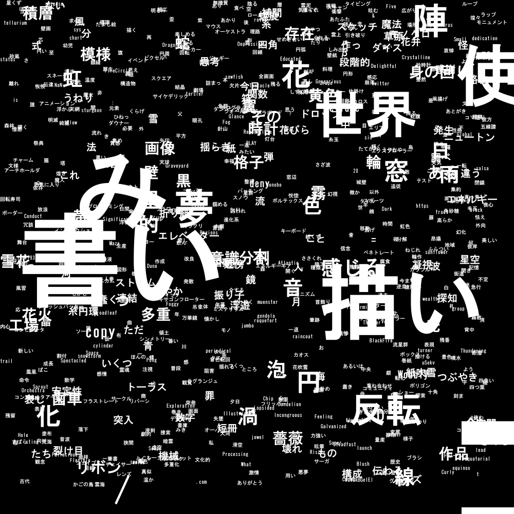
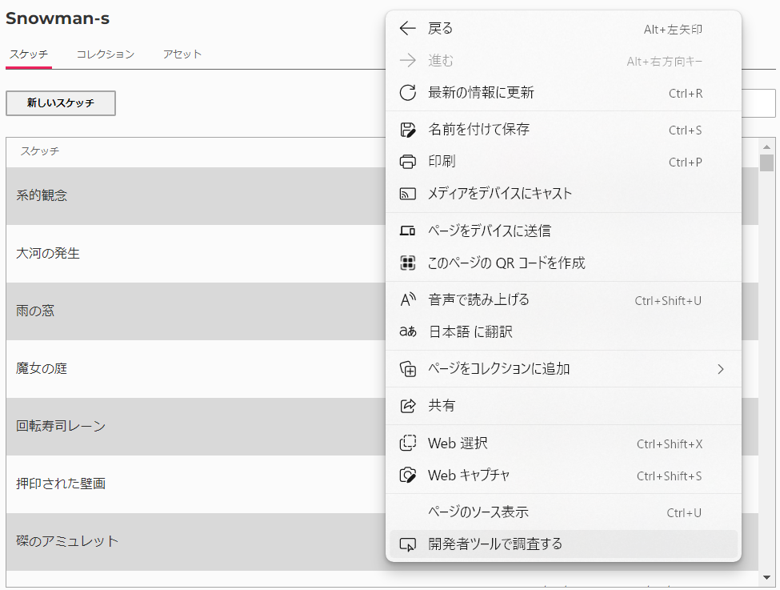
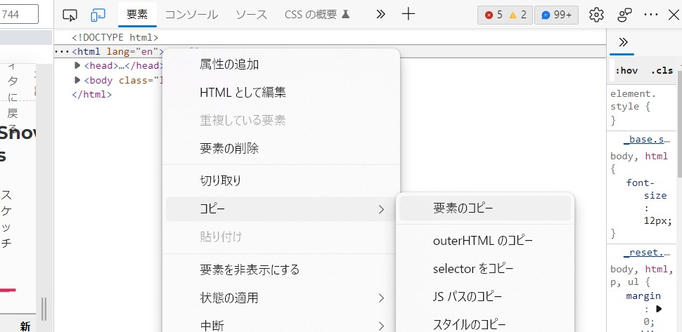

# p5 WebEditor Analysis

## これは...?

与えられた p5.js WebEditor のスケッチリストのページの HTML から、あなたがスケッチにどの様な名前を多く付けているかを表す画像を生成します(日本語用)。

(HTML をとってくる機能はありません。規約的に出来ませんでした。)

> 出来上がる画像例：
>
> 

## 使い方

(以下の説明は使用環境に応じて適宜読み替えてください)

### 必要モジュールのインストール

```
> pip install -r requirements.txt
```

### HTML コードの受け渡し

まず、p5.js WebEditor の、スケッチリストのページ (https://editor.p5js.org/\<ユーザー名\>/sketches) をブラウザで開いてください。

次に、右クリックして現れるメニューから、開発者ツールを開いてください。

> Edge の場合：  
> 

その開発者ツールの、「要素」のタブで現れている \<html\> タグを右クリックして現れるメニューから、「コピー > 要素のコピー」を右クリックします。これで HTML がコピーされました。

> Edge の場合：  
> 

最後に、consts.py に以下のような形式で HTML コードを貼り付けます。

```python
html = """
  <HTML コード>
"""
```

### 実行

```
> python main.py
```

うまく行けば、同ディレクトリに"out.jpg"ファイルが出力されているはずです。
